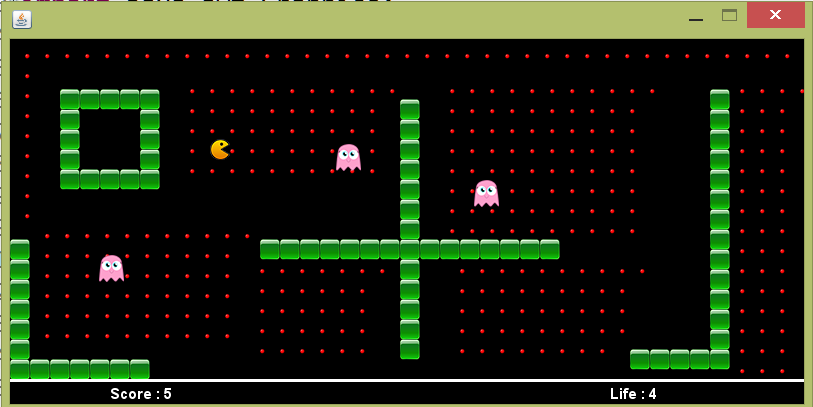

# Pacman_java

The idea of using Pac-Man to illustrate the usage of Design Patterns came to me while I was reading an article about Pac-Man by Jamey Pittman. His article was about the design and AI lessons within the classic Namco game Pac-Man. I was really amazed at the complexity in the design and AI of a game that seems so simple while playing at the time. I then decided to create a series of articles which illustrate the use of Design Patterns to implement some of the complex design issues in the game Pac-Man.
